## Introduction & Declaration
---

Tik-Tok is an iOS application that can help people manage their time by automatically arranging, recording and notifying the schedules imported to this application. It was developed for course "CSE208 Software Engineering Group Project" by team Echo at Xi'an Jiaotong-Liverpool University in 2018.    

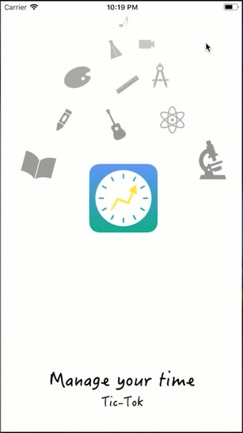

**Notice: Directly clone or download this repository can not get a runnable application.**

This repository only demonstrates the source code 100% contributed by me. The complete project also contains other source code files, storyboard files and UI image sets. Through I made important contribution to major of them, I still decided not to build this repository as same as its original project file structure. Because it's not easy to find files in that structure.   

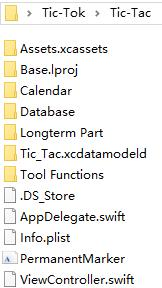 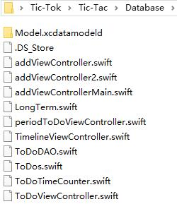 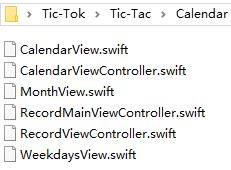

   
Users who are interested in Tik-Tok can download the [Tik-Tok.zip](Tik-Tok.zip) in this repository, extract it and run it in Xcode IDE (Xcode is only released in macOS).

## Main Functions
---
* Users can record what they what to do in Tik-Tok by creating a new to-do task. The main screen of this app shows all today's tasks (ordered by their excepted finish time).

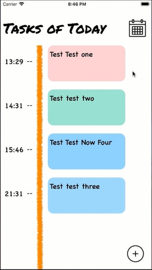 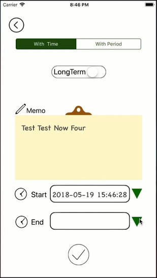

* Users can find the record of previous days in the calender view.

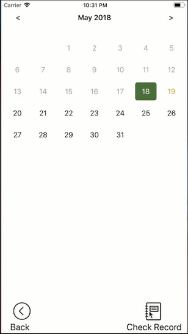 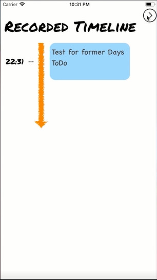

**One of the most important feature of Tik-Tok is the long-term task management. Users can save their daily contributions to their long-term tasks, such as a research project or a plan of memorizing 3000 English words. They are also able to check the process of their current long-term tasks and review their previous works.** 
* Users can create long-term tasks.

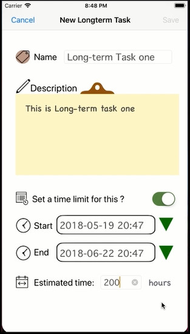 

* When users creating a to-do task, they can relate this small task to a long-term one.

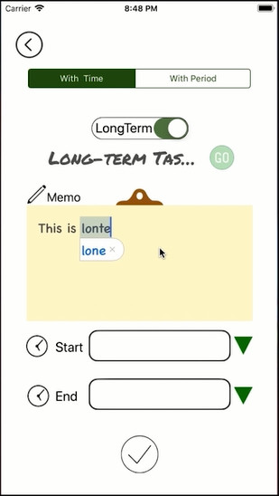 

* Tik-Tok sends notification to the user 5 minutes before the end time of a "to-do task".

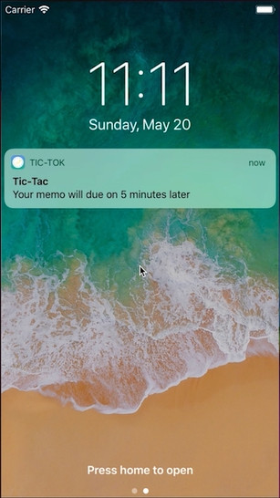

* If a "to-do task" were marked as finished, the time it spent will be add to the total time spent on the long-term task it related to. 
    * For long-term tasks which sets up a estimated required time, their current rate of progress will be shown visually.
    * For the others, only the total time spent on them so far will be shown.

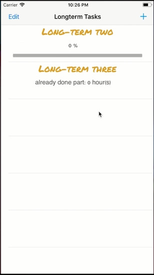

* Users can find details of long-term task (also fine with finished ones).

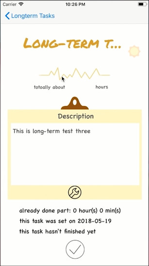 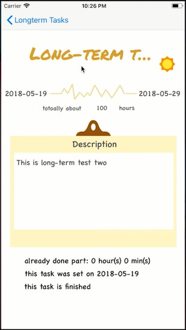

* Users can edit or delete all created tasks.

## Reference
---
This is the [repo](https://github.com/cse208echo/GroupProject) we used in group development

